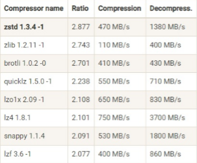
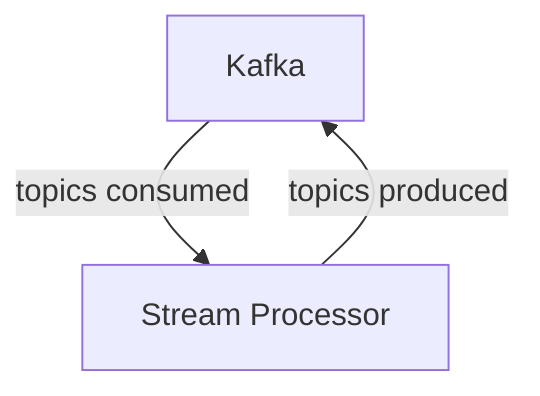

# 消息队列闲谈

## Kafka Controller and leader election
Each broker have a controller, and the leader controller is elected by zookeeper.

## Replica in Kafka

## leader/follower model for replication
When some records are produced to a topic, they are [first written to the log of the leader broker](https://github.com/apache/kafka/blob/cb9557a99050bf317cb347cc7756a61f25ce032d/core/src/main/scala/kafka/server/ReplicaManager.scala#L592). The followers fetch the records from the leader, write them to their logs, and acknowledges the leader. A record is considered committed when it has been written to the log of the leader and all in-sync replicas. The leader will notify the producer once the record is committed. The producer can then safely assume that the record will not be lost as long as at least one in-sync replica remains alive. 

The leader controller elects the leader and monitors all replicas. If the leader fails, the controller will elect a new leader.

Replica State: [None](https://github.com/apache/kafka/blob/cb9557a99050bf317cb347cc7756a61f25ce032d/core/src/main/scala/kafka/server/ReplicaManager.scala#L170), [Offline](https://github.com/apache/kafka/blob/cb9557a99050bf317cb347cc7756a61f25ce032d/core/src/main/scala/kafka/server/ReplicaManager.scala#L180), and [Online](https://github.com/apache/kafka/blob/cb9557a99050bf317cb347cc7756a61f25ce032d/core/src/main/scala/kafka/server/ReplicaManager.scala#L175)

Online: The replica is in-sync with the leader and is ready to serve requests.

Offline: The replica is syncing with the leader and is not ready to serve requests.

None: The replica is invalid and is not ready to serve requests.

## Implementation of Log(Record): Skiplist

Now Kafka uses skiplist to implement the log. The skiplist is a data structure that allows fast search within an ordered sequence of elements.

Insert: O(log n), SkipList supports random insert, but in Kafka, the insert is always at the end of the list.

Search: O(log n)

Delete: O(log n)

See [leetcode 1206](https://leetcode.com/problems/design-skiplist/) for more details.

## Log Compression
A basic idea to reduce bandwidth and storage is to compress the log. Kafka supports various compression algorithms, including GZIP, Snappy, LZ4, and ZSTD.

The compression usually happens at the producer side, it can also happens at the broker side, and the decompression happens at the consumer side. 
```
producer -> broker -> consumer
```
I guess the compression at the broker side is for the case that the producer is not able to compress the data, e.g. IoT devices.



## In-order delivery
Kafka guarantees in-order delivery for each partition. The producer will wait for the previous record to be committed before sending the next record. The consumer will read the records in the same order as they are written to the log.

In such case, we can only have one producer and one consumer for each partition. If we have multiple producers, the records from different producers may be out of order. If we have multiple consumers, the records from different consumers may be out of order.

## Exactly Once in Kafka
### Target use case: 
stream processing

Expected behavior: a record is processed exactly once even if the stream processor crashes/get timeout.

stream processor is both producer and consumer.
### Where can failure happen?
1. Broker failure
2. Producer to Broker RPC failure
3. Client failure

### Transection in Kafka
[blog](https://www.confluent.io/blog/transactions-apache-kafka/)
a group of messages in same or different topics that are either all committed or all aborted.

Kafka introduced Control Message, which is a message that is not part of the log, but is used to control the log. The control message is used to commit or abort a transaction.

#### Two-phase commit
[blog](https://donggeitnote.com/2022/02/15/kafka-exactly-once/)


### Idempotence:
Each producer has an unique, immutable transactional id.

Assign a producer id to each producer(base on transactional id).

Assign a sequence number to each record.

if the producer id and sequence number are the same as the previous record, the record is a duplicate.

if the sequence number not equal to the previous record + 1, it means some records are lost(out of order).

If a producer crashes and we start a new one, it will use the same transactional id, and increase an extra counter, and the broker will assign the same producer id to the producer. The producer will continue to produce records with the same producer id and sequence number. The broker will detect the duplicate records and drop them.

If the crashed producer is still restarted and back, because its counter is not increased, all its records will be dropped by the broker.

As duplicate records are dropped, the producer can alway retry the failed records without worrying about duplicate records. In this way, the producer to Kafka is "exactly once".

## Other
[Mafka](https://tech.meituan.com/2022/08/04/the-practice-of-kafka-in-the-meituan-data-platform.html)