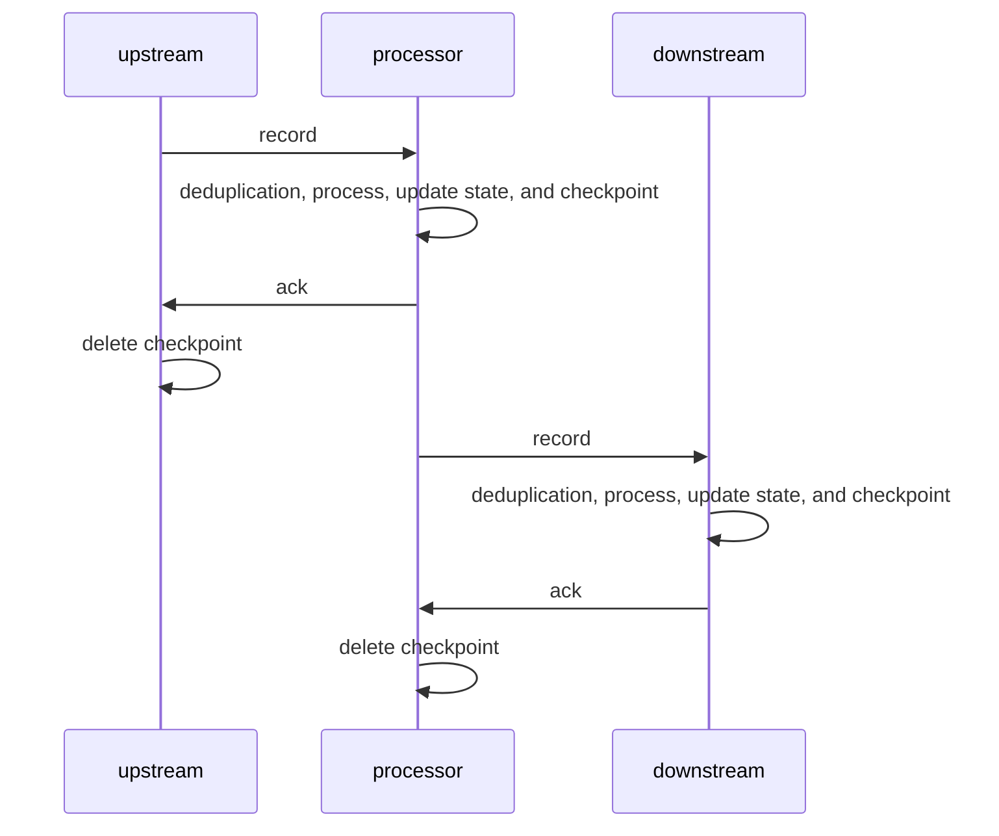
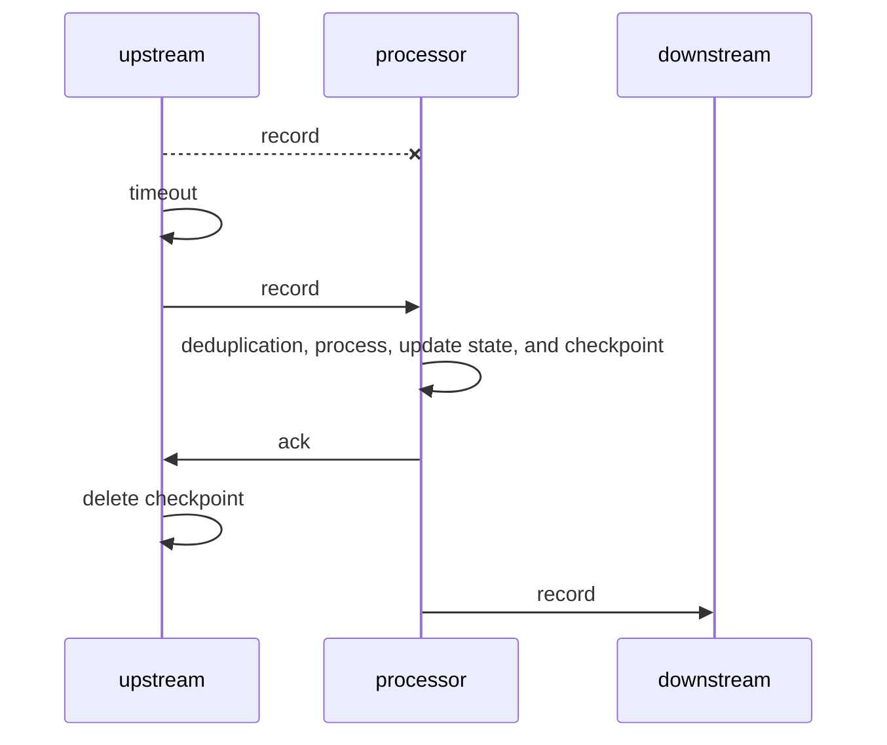
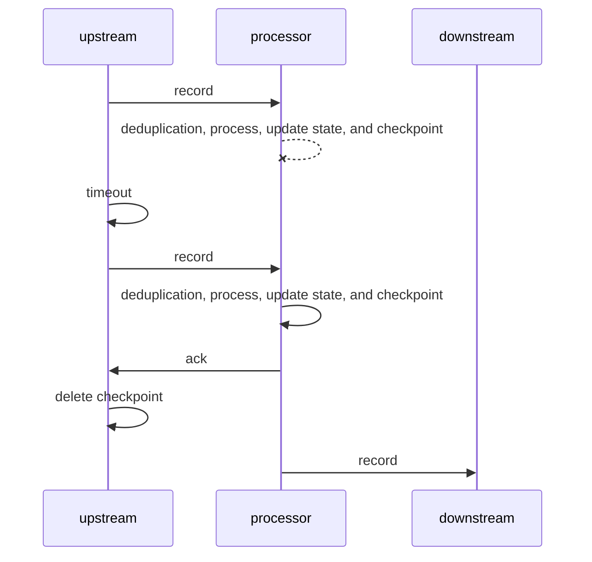
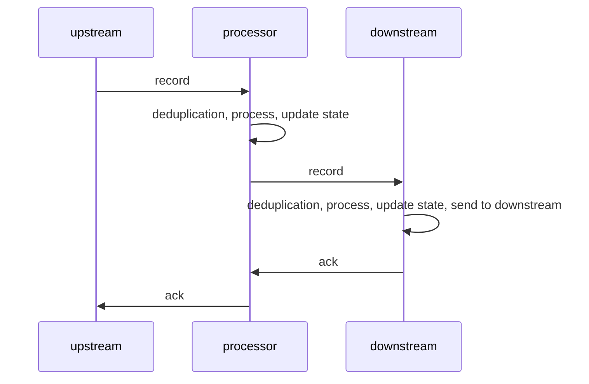
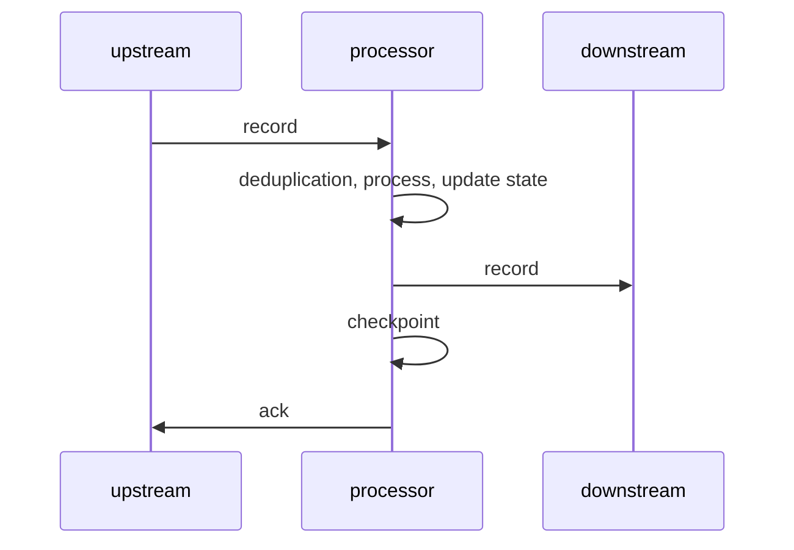
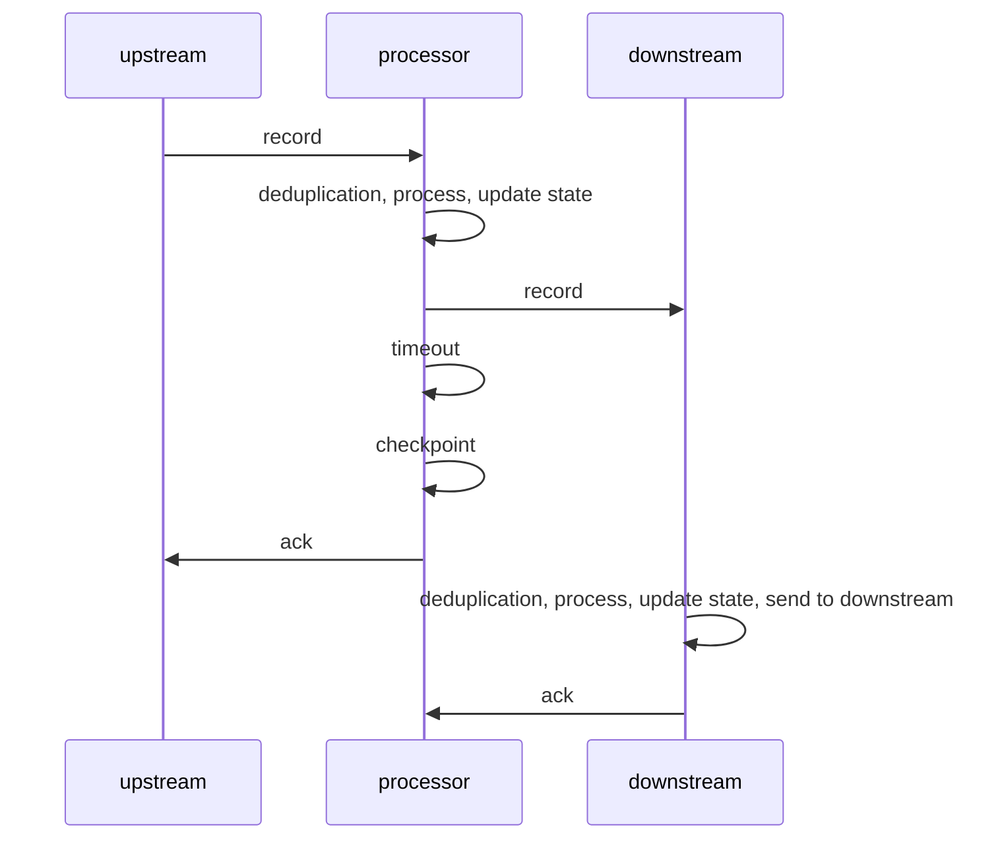
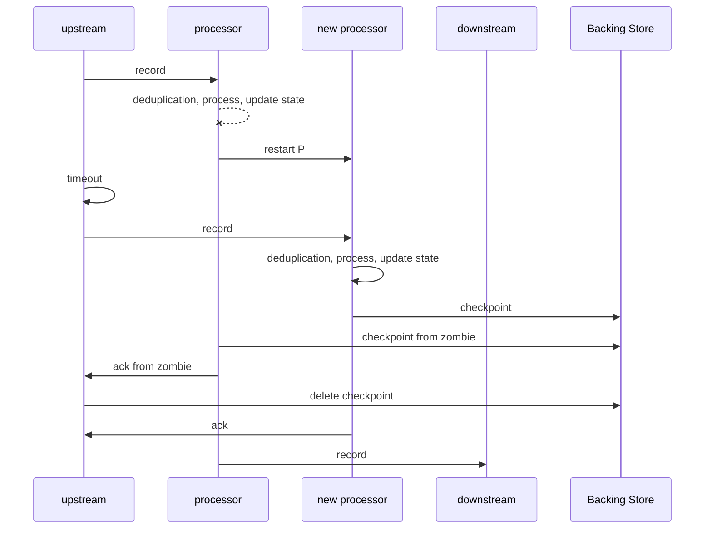

# MillWheel
Strong productions: 

each operation is atomic(may be with transaction)

if record sending fails, then the record is re-sent

If the process/state update/checkpoint/ack fails, then the record is re-sent

Because the records will be deduplicated, crash during ack does not matter

Weak productions:

Most weak solution is just don't checkpoint at all. For retryability, The upstream may open many RPC if any downstream is slow

send to downstream before checkpoint

Smarter solution, only checkpoint if downstream acks is slow

# State Manipulation
If the process/state update/checkpoint/ack delays, the system start a new machine.

